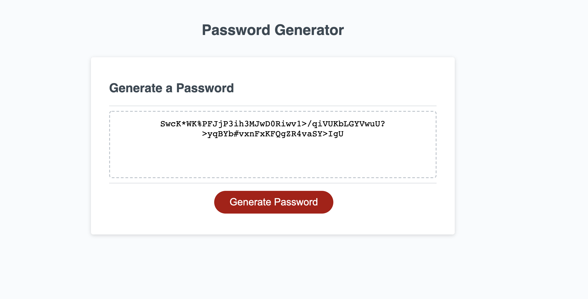

# jillsBestPasswordGenerator
## Here is what I did 

- For this project we wanted to create a simple password generator that allowed you to choose between numbers, uppercase letters, lowercase letters and special characters. 
- I built this project to better understand the basics of javascript. While doing the homework and researching I realized there were probably a 1000 different ways you could have made this project. 
- I decided to build this project based on how I could best understand what I was writing. I wanted to know the concepts and functions while I was executing them. 
- I learned about for loops, if else statements, and the importance of arrays and how to combine them. I also learned js is how prompts appear on your browser these can be alerts, confirms, or prompts. I learned how to use Math.floor and Math.random and how useful these things can be. I learned I like keeping code minimal. I think I could have made this more complicated but was excited when it worked with my basic coding. 
## Here is a preview of my work:

## Here is a link to my work:
[See it here](https://jilliankayworks.github.io/jillsBestPasswordGenerator/)

## Table of Contents 
- [Installation](#installation)
- [Usage](#usage)
- [Credits](#credits)
- [License](#license)
## Installation
web browser 
## Usage
This shows one of many ways to create a password generator in js and shows many different concepts. 
## Credits
DU Bootcamp 
## License
MIT 

